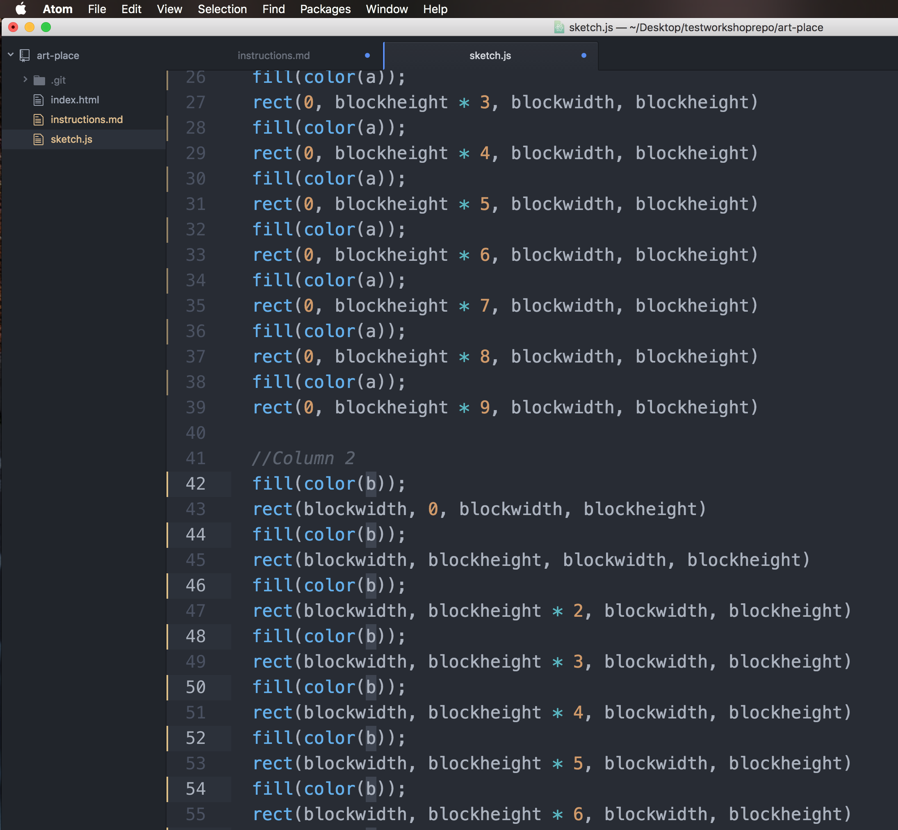

# Summary
This section of the project will help us learn to make atomic commits. These are my favorite.

** Don't make any commits until you're directed to in the instructions**

## Exercise Two
- Step one: Open your index.html file in your local browser.
- Step two: Using your text editor, change the letter `a` to the letter `b` in `column 2`. Should look like this:
  
  - Pro tip: You can use Command + D to highlight a variable and all following instances of that variable in Atom + Sublime. You can also use Command + Option + G to highlight ALL instances of a variable. [Windows + Linux commands here.](https://www.sublimetext.com/docs/2/multiple_selection_with_the_keyboard.html)
- Step three: Using your text editor, change the letter `a` to the letter `c` in `column 3`.
- Step four through ???: Continue repetition of these steps for each variable on lines 10 - 16 until you are bored. Add new variables to complete the whole grid if you're interested.
- Step five: When your grid looks satisfactory, type `git status` to confirm that your file changes have been tracked via git.
- Step six: Type `git add -p`. Stage **only** the changes for column 2.
- Step seven: Type `git status`, and notice that you have multiple versions of the sketch.js document.
- Step eight: Commit the staged changes.
- Step nine: Repeat steps six through eight until you are bored.

## Next Steps
- Close out all current files on your text editor to avoid accidental overwrites and complexity.
- Type `git checkout merge-conflict` to switch to the next exercise and follow the instructions in `instructions.md`.
