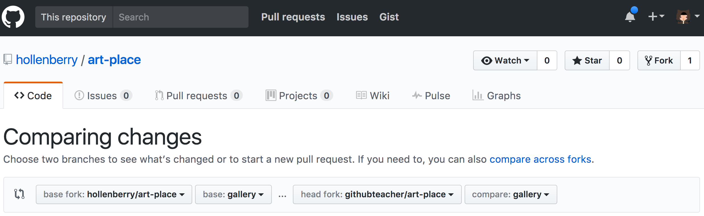

# Summary
This repository serves as an example of pixel art. You'll use it as a template to create your own file.

## Extended Exercise
### Section 1
- Step one: Open up the `index.html` file in your browser
- Step two: Applaud the artistic genius displayed in front of you.
- Step three: Standing ovations, please.
- Step four: Think about what you'd like your own file/pixel art to look like!
- Step five: In the `index.html` file, change line 6 from `hollenberry-octocat.js` to `YOUR_USERNAME-YOUR_FILE_SUBJECT.js` (obviously, don't type YOUR_FILE_SUBJECT, but instead the name of whatever you intend to make. ex: emoji.js, sun.js)
- Step six: In your command line, type `git mv blanktemplate.js YOUR_USERNAME-YOUR_FILE_SUBJECT.js`
- Step seven: In your command line, type `git rm hollenberry-octocat.js`
  - The above two steps are best practices for renaming and removing files previously tracked in git
- Step eight: `Add`, `commit`, and `push` those changes

### Section 2
- Step nine: Return to the GitHub UI at your fork URL: www.github.com/YOUR_USERNAME/art-place
- Step ten: Click the `Pull Requests` tab
- Step eleven: Click `New Pull Request`
- Step twelve: Change the drop-down so that it looks like this (substitute your username for githubteacher):
  
- Step thirteen: Click `Create Pull Request`
- Step fourteen: Write a descriptive title about what you intend to introduce. Write questions in your PR for items that you want to ask others to think about with regard to your change

### Section 3
- Step fifteen - ???: Code Review steps
- Step sixteen: Update your code based on the code review feedback
- Step seventeen: When you're happy with how your file looks, ping @hollenberry in your Pull Request and I'll perform a reverse merge to incorporate your changes.

:tada: All done! :tada:

## Next Steps
- Look at the original readme on the `master` branch for extended resources and extra content curated and produced by the GitHub training team
- Help me think about ways that I can make this project better! Open an issue or a PR with changes to kick off the discussion
