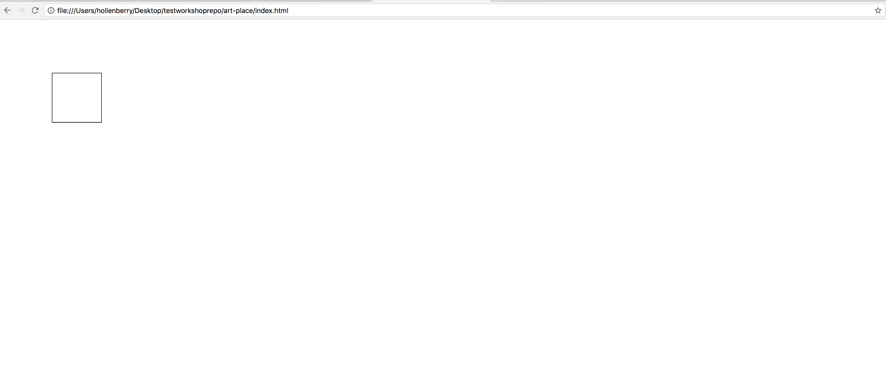
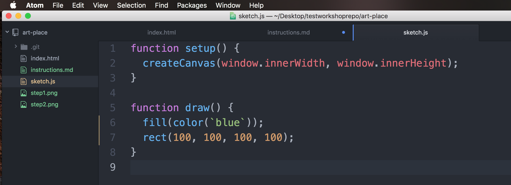
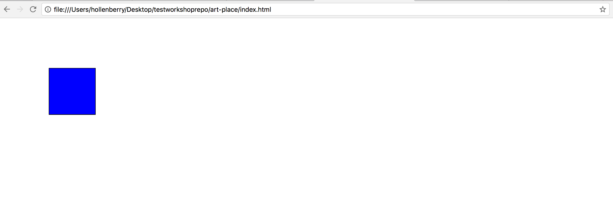

# Summary
This project uses a JavaScript library called [p5.js](https://p5js.org/).

Their stated goal:
> Make coding accessible for artists, designers, educators, and beginners.

With that said, these exercises are based on simple drawing and art. No prior HTML/CSS/JS knowledge required.

If you'd like to see a really intricate example of completed pixel art (by 5th graders!) that uses this language, or what we're looking at for an end result, you can find that on the `examples` branch of this repository.

## Exercise One

- From your File Explorer or Finder, open the index.html file in your browser. Should look like this after opening:

- Since we're just getting our feet wet, we'll make a change to the repository and turn that circle into a rectangle.
  - On line 6 of `sketch.js`, change `ellipse`(leavethenumbersalone) to `rect`(leavethenumbersalone)
  - Save, then refresh the page in your browser. Should look like this:
  
  - If this looks correct, commit your change by using the core Git commands you've been taught!
    - `git status`,`git add FILE`, `git commit -m "DESCRIPTION"`, `git push`
- Practice makes perfect! Let's make another commit. This time, we'll fill the rectangle in with color.
  - In `sketch.js`, move line 6 to line 7, and on line 6, type the following command.  
    - `fill(color(`blue`));`
    - If you want to substitute `blue` for your favorite color, feel free.
  - Your code should look like this:
  
  - Your file should look like this in your browser.
  
  - If this looks correct, commit your change by using the core Git commands you've been taught!
    - `git status`,`git add FILE`, `git commit -m "DESCRIPTION"`, `git push`

## Next Steps
- Close out any open files in your text editor (don't want to risk accidental overwrites and confusion).
- Checkout to the atomic-commits branch, and follow the instructions in the `instructions.md` file.

## Extra Credit
We're just getting started with what p5.js can do!
 - Want to see all the different [shapes](https://p5js.org/reference/#group-Shape) you can make? Go ahead and experiment on this branch, we won't be merging it.
